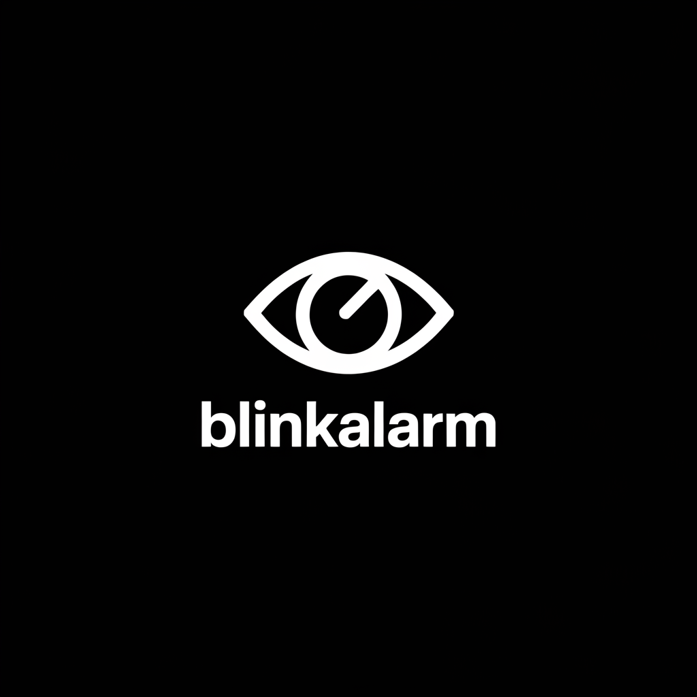
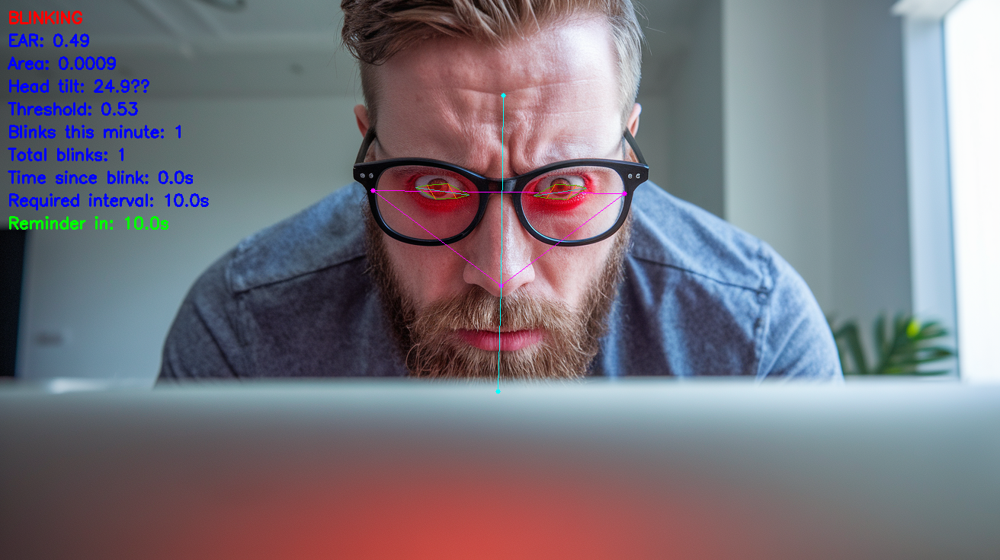

# BlinkAlarm 👁️



BlinkAlarm is an intelligent computer vision system that helps prevent digital eye strain by monitoring your blink rate in real-time. Using your webcam and advanced facial landmark detection, it provides gentle reminders when you're not blinking enough during focused computer work.


*BlinkAlarm's real-time facial landmark detection and analysis*

## Why BlinkAlarm?

When we're focused on screens, our blink rate can drop from a healthy 15-20 blinks per minute to just 3-4 blinks per minute. This reduced blinking leads to dry eyes, eye strain, and potential long-term issues. BlinkAlarm helps retrain your natural blinking patterns while you work.

## Features

- Real-time blink detection using advanced computer vision
- Head tilt compensation for accurate blink detection at any angle
- Gentle audio reminders when you need to blink
- Detailed metrics including blink rate and timing
- Extremely lightweight - tested on M2 MacBook Pro with negligible CPU/power impact
- Configurable processing rate to further optimize performance

## Installation
```bash
Create and activate virtual environment
python -m venv venv
source venv/bin/activate # On Windows: venv\Scripts\activate
Install dependencies
pip install poetry
poetry install
```


## Usage

Basic usage:
```bash
poetry run python blinkalarm.py
```

Additional settings:
```bash
poetry run python blinkalarm.py --frames 1 --threshold 0.45 --required-bpm 6
```


### Parameters

- `--frames N`: Process one frame for every N frames (default: 1)
- `--threshold`: EAR (Eye Aspect Ratio) threshold for blink detection (default: 0.45)
- `--required-bpm`: Required blinks per minute (default: 6)

## Recommended Usage

BlinkAlarm is designed to run in the background during your computer work. The default setting of 6 blinks per minute (reminder every 10 seconds without blinking) is a gentle starting point. While health recommendations suggest 15+ blinks per minute, starting lower helps build the habit without being disruptive.

### Suggested Progression
1. Start with 6 blinks per minute (default)
2. Once comfortable, increase to 8-10 blinks per minute
3. Gradually work up to 12-15 blinks per minute

If you find the processing impacting performance (unlikely), increase the `--frames` parameter. Each increment processes fewer frames, reducing CPU usage.

## Future Features Under Consideration

- [ ] Auto-start on system boot
- [ ] Volume control for reminders
- [ ] GUI for easy configuration
- [ ] 20-20-20 rule integration (look at something 20 feet away every 20 minutes for 20 seconds)
- [ ] Look-away detection and timing
- [ ] Performance optimizations

Feedback on which features would be most valuable is welcome!

## Requirements

- Python 3.8+
- Webcam
- Dependencies ( `poetry install`):
  - OpenCV
  - MediaPipe
  - NumPy
  - SimpleAudio

## Platform Support

Tested on:
- macOS (M2 MacBook Pro)

Should work on Windows and Linux, but needs testing.

## Contributing

Contributions are welcome! Please feel free to submit a Pull Request.

## License

MIT License - see LICENSE file for details


